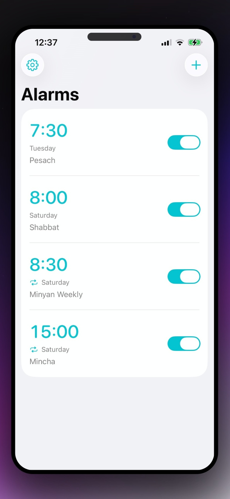
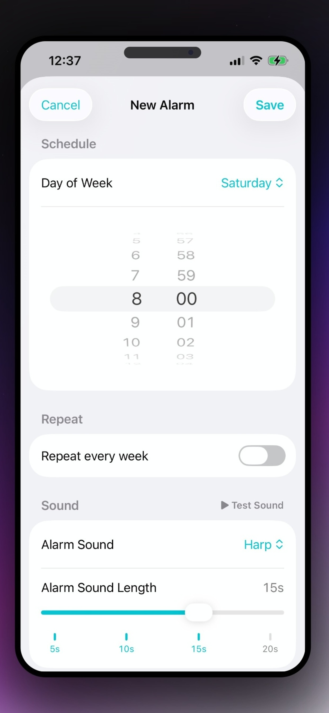

<p align="center">
  
</p>

<h1 align="center">Shabbat Alarm Clock</h1>

<p align="center">
  A calm, local-first iOS alarm app built around the weekly rhythm of Shabbat.
</p>

<p align="center">
  
  
  
  
  
</p>

> Most alarm apps assume tomorrow looks like yesterday.
> Shabbat Alarm Clock is built for a different rhythm: choose the day, choose the sound, decide whether it repeats, and keep the experience simple.

<p align="center">
  
  
</p>

## Overview

Shabbat Alarm Clock is a focused SwiftUI iPhone app for creating and managing Shabbat-oriented alarms without the overhead of accounts, cloud sync, or complicated setup. It is designed around a weekly cadence instead of a generic daily alarm workflow.

The app lets people create alarms for a chosen weekday, decide whether they should repeat every week or fire only once, customize the sound and playback length, and manage everything in either English or Hebrew. It also handles right-to-left layout, theme color selection, and local notification scheduling directly on device.

## Why This Exists

Built-in alarm apps are great at "every weekday at 7:00 AM."

They are usually less thoughtful about:

- once-a-week routines
- Shabbat-specific timing habits
- bilingual presentation
- right-to-left layout behavior
- simple local control without a backend

This project keeps the scope intentionally tight: make alarms easy to create, easy to edit, and dependable once notification permission is granted.

## Highlights

- Weekly alarms tied to a specific day of the week.
- Optional one-time alarms that automatically disable themselves after their scheduled fire date passes.
- Three bundled sounds: `chimes`, `alarm`, and `harp`.
- Adjustable sound lengths with supported durations of `5`, `10`, `15`, and `20` seconds.
- In-app sound preview before saving an alarm.
- English and Hebrew localization.
- Full right-to-left layout support for Hebrew.
- User-selectable accent color themes.
- Local persistence with `UserDefaults` and JSON encoding.
- Notification permission guidance, settings shortcuts, and reminder flows.
- Notification scheduling logic that avoids duplicate pending alerts for overlapping alarm slots.

## App Behavior

- Repeating alarms are scheduled as weekly local notifications.
- One-time alarms store their next trigger date and are reconciled when the app becomes active again.
- If notifications are denied, alarms can still be created, but they remain disabled until permission is granted.
- Sound previews use bundled audio files and respect the selected sound duration.
- Alarm labels are normalized so empty labels fall back to a localized default.

## Tech Stack

- Swift 5
- SwiftUI
- `UserNotifications`
- `AudioToolbox`
- `UserDefaults`
- `StoreKit`

## Run Locally

### Requirements

- macOS with Xcode installed
- iOS 17.6 or later
- An iPhone or iOS Simulator target

### Xcode

1. Open `ShabbatAlarmClockiOS.xcodeproj` in Xcode.
2. Select the `ShabbatAlarmClockiOS` scheme.
3. Choose an iPhone simulator or connected device.
4. Press `Run`.
5. Allow notifications on first launch so alarms can be scheduled.

### Command Line

```bash
xcodebuild -project ShabbatAlarmClockiOS.xcodeproj \
  -scheme ShabbatAlarmClockiOS \
  -configuration Debug \
  -destination 'generic/platform=iOS' \
  build
```

## Project Tour

<details>
<summary><strong>Structure</strong></summary>

```text
ShabbatAlarmClockiOS/
├── Models/          Alarm data and bundled sound definitions
├── Persistence/     Local storage and reminder preference state
├── Services/        Notification scheduling and sound preview playback
├── Utilities/       Date formatting and keyboard-dismiss helpers
├── ViewModels/      App state and alarm management logic
├── Views/           SwiftUI screens and reusable UI components
├── en.lproj/        English strings
├── he.lproj/        Hebrew strings
└── Assets.xcassets/ App icon and color assets
```

</details>

### Key Files

- `ShabbatAlarmClockiOS/Views/AlarmListView.swift` drives the main alarm list, settings menu, add flow, and edit flow.
- `ShabbatAlarmClockiOS/Views/AddAlarmView.swift` handles alarm creation, sound testing, weekday selection, repeat settings, and deletion.
- `ShabbatAlarmClockiOS/ViewModels/AlarmListViewModel.swift` owns alarm CRUD, notification permission state, and notification refresh behavior.
- `ShabbatAlarmClockiOS/Services/NotificationServiceError.swift` contains the notification scheduling service and alert deduplication logic.
- `ShabbatAlarmClockiOS/AppLocalization.swift` powers English/Hebrew switching and right-to-left layout handling.
- `ShabbatAlarmClockiOS/AppTheme.swift` defines the app's selectable accent colors.

## Assets For This README

The README now has a dedicated asset area in `docs/images/`.

| Asset | Path | Notes |
| --- | --- | --- |
| Logo | `docs/images/logo.png` | Currently populated from the existing app icon so the README renders immediately. Replace it with your final logo any time. |
| Hero screenshot | `docs/images/hero-screenshot.png` | This is the single screenshot path to use. Best option: the main alarm list with a few sample alarms and your preferred accent color. |
| Temporary placeholder | `docs/images/hero-placeholder.svg` | Used until the final screenshot is added. |

## Notes For Contributors

- The app is local-first and intentionally lightweight.
- Alarm data is stored on device rather than synced remotely.
- The notification layer is a core part of the product, so changes that affect scheduling behavior should be tested carefully.
- Localization matters here: UI changes should be checked in both English and Hebrew.

## License

This project is available under the [MIT License](LICENSE.md).
